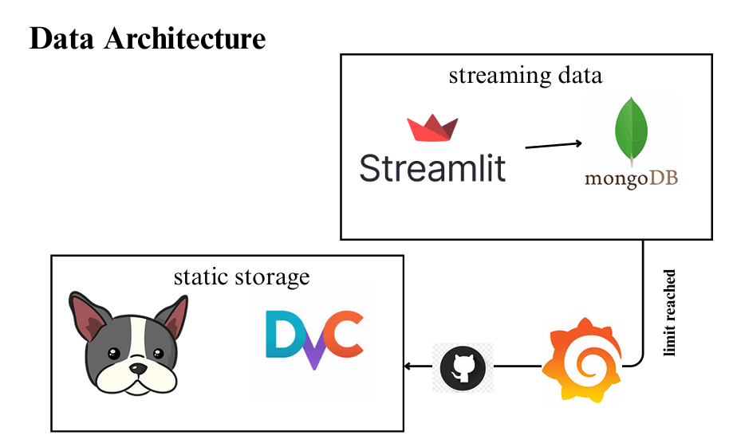

# BARKALYZE

“This isn’t just code it’s a reflection of what should be taught before frameworks, tools, or AI.”

---

## 🚀 Built with the tools and technologies:

| Tech Stack |
|------------|
|     |
|     |
|     |
|    |

---

## 📘 Project Overview

At the heart of Barkalyze lies a different kind of purpose:
Not to chase flashy utility or jump on the latest AI bandwagon—
—but to master the craft of building intelligent systems the right way.

We’re not here to vibe code.
We’re here to engineer.

In today’s Gen-Z coding culture, most student projects revolve around copying snippets from AI tools, wiring things up with minimal understanding, and celebrating half-working demos. What’s lost in the process? The fundamentals: architecture, clarity, reproducibility, maintainability.

Barkalyze is our counter-response to that trend—a fully-engineered AI system not built to impress, but to inspire better practice.
It’s not about what it does. It’s about how beautifully and thoughtfully it’s done.

🎯 What This Project Stands For
"Student projects should be playgrounds for architecture, experimentation, and engineering hygiene—not just shipping features."

✅ PEP8-compliant, modular, and human-readable code

✅ Clearly defined function contracts, with purpose and documentation

✅ Structured architecture: separation of concerns across components

✅ Dockerized & environment-driven setup

✅ Pipeline automation, not manual workflows

✅ Version-controlled everything: code, data, models

✅ MLflow & DVC for reproducibility and traceability

✅ Monitoring-first mindset with Prometheus + Grafana dashboards

✅ Beautifully declarative configs (YAML/JSON) for predictable environments

✅ No magic, no guesswork—just clean systems thinking

---

⚙️ Environment Setup
“Reproducibility isn’t a bonus—it’s the foundation.”

This project was built with Python 3.11.4, and every component is configured for easy local or containerized deployment. Follow the steps below to get everything running cleanly.

📁 1. Clone the Repository

git clone https://github.com/Saivamshi-git/barkalyze.git
cd barkalyze
Make sure you're using Python 3.11.4 if running manually.

📄 2. Install Python Dependencies (for local development)
If you want to run components manually (e.g., Streamlit), set up a virtual environment:

python3.11 -m venv barkenv
source barkenv/bin/activate  # On Windows: barkenv\Scripts\activate
pip install -r requirements.txt

📦 3. Backend Setup using Docker Compose
The backend is fully containerized using Docker Compose, which automatically sets up:

🚀 FastAPI app (model inference + metrics)

📊 Prometheus (metrics collection)

📈 Grafana (real-time dashboard)

🔐 Configure Your .env File First
Before running Docker Compose, create a .env file in the root directory with the following:

MONGODB_URI = mongodb://<your_mongodb_url>
REPO_OWNER = <your_dagshub_username>
REPO_NAME = <your_repo_name>

🐳 4. Start the Backend Stack
Once your .env is ready, run:

docker-compose up --build

This will launch:

Service	URL
FastAPI	http://localhost:8000/metrics
Prometheus	http://localhost:9090
Grafana	http://localhost:3000

🖥 5. Streamlit Frontend Setup
You can run the Streamlit app independently from the /frontend directory:

in Frontend/app.py (make changes this way)

then run

cd Frontend
streamlit run app.py

---

# Pipeline Workflows
1. Update config.yaml
2. Update secrets.yaml [Optional]
3. Update params.yaml
4. Update the entity
5. Update the configuration manager in src config
6. Update the components
7. Update the pipeline
8. Update the main.py
9. Update the dvc.yaml

🔁 DVC Workflow: Step-by-Step to get your pipeline work

🧱 1. Initialize DVC (only once)
dvc init

2. make the pipeline run to create a lock file
set PYTHONPATH=.
dvc repro

🧠 3. Visualize the Pipeline
dvc dag

🔁 Data Workflow: Step-by-Step to versioning the updated dataset

🔹 Step 1: Clean and Prepare the Dataset
python data_versioning/cleaning_data.py

🔹 Step 2: Add the Dataset to DVC

dvc add data_versioning/emotion_dataset

🔹 Step 3: Commit the DVC Metadata to Git

git add data_versioning/emotion_dataset.dvc .gitignore
git commit -m "Add emotion dataset version 2"

🔹 Step 4: Tag the Dataset Version

git tag v2
git push origin v2

The current data will be uploaded in the storage of dagshub and you can use it based on the version

make changes in the pipeline to get the current version dataset
in src\bark\pipeline\stage_01_dataingestion.py

---

### optional things

uvicorn connect.api:app

docker-compose down --volumes
docker-compose up --build

### cleaning dataset

dvc remove artifacts/data_ingestion/emotion_dataset.dvc

dvc gc -w --force

git add .
git commit -m "Remove old dataset for reset"
git push origin main

